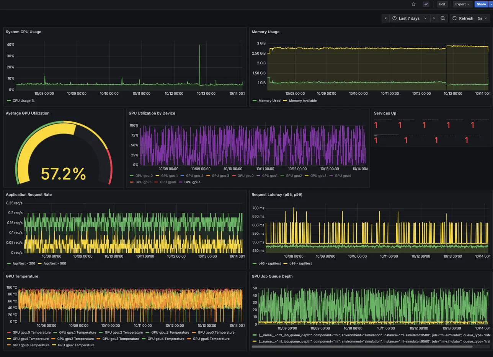

# GPU Infrastructure Monitoring Stack

**Status:** ✅ Completed | **Platform:** Docker Compose | **Environment:** Google Cloud Platform

A production-grade monitoring infrastructure for GPU workloads, demonstrating observability patterns for containerized applications at scale.

---

## 📊 Project Overview

This project implements a complete observability stack for GPU infrastructure monitoring using industry-standard tools. Built as a foundation for understanding monitoring patterns before transitioning to Kubernetes-based deployments.

### Key Achievements

- **1,145 unique metrics** tracked across infrastructure and applications
- **14 containers** orchestrated with Docker Compose
- **32+ hours** of continuous uptime with zero downtime
- **9 monitoring targets** with 100% availability
- **57% average GPU utilization** across 8 simulated GPUs
- **Sub-second query performance** (~40ms average)

---

## 🏗️ Architecture

```
┌─────────────────────────────────────────────────────────┐
│              Google Cloud Platform (GCP)                 │
│  ┌───────────────────────────────────────────────────┐  │
│  │         e2-medium Instance (2 vCPU, 4GB RAM)      │  │
│  │  ┌─────────────────────────────────────────────┐ │  │
│  │  │      Docker Network: monitoring             │ │  │
│  │  │                                             │ │  │
│  │  │  Core Monitoring:                          │ │  │
│  │  │  • Prometheus (metrics)                    │ │  │
│  │  │  • Grafana (visualization)                 │ │  │
│  │  │  • AlertManager (alerting)                 │ │  │
│  │  │                                             │ │  │
│  │  │  System Exporters:                         │ │  │
│  │  │  • Node Exporter (system metrics)          │ │  │
│  │  │  • cAdvisor (container metrics)            │ │  │
│  │  │                                             │ │  │
│  │  │  Application Stack:                        │ │  │
│  │  │  • Nginx + Exporter                        │ │  │
│  │  │  • Redis + Exporter                        │ │  │
│  │  │  • PostgreSQL + Exporter                   │ │  │
│  │  │  • Python App (custom metrics)             │ │  │
│  │  │                                             │ │  │
│  │  │  Simulation Layer:                         │ │  │
│  │  │  • GPU Simulator (8 GPUs)                  │ │  │
│  │  │  • ML Workload Simulator                   │ │  │
│  │  │  • Load Generator                          │ │  │
│  │  └─────────────────────────────────────────────┘ │  │
│  └───────────────────────────────────────────────────┘  │
└─────────────────────────────────────────────────────────┘
```

---

## 🚀 Tech Stack

### Core Monitoring
- **Prometheus** - Time-series database and metrics collection
- **Grafana** - Dashboard visualization and alerting
- **AlertManager** - Alert routing and management

### System Exporters
- **Node Exporter** - Host system metrics (CPU, memory, disk, network)
- **cAdvisor** - Container resource usage and performance metrics

### Application Stack
- **Nginx** (Alpine) - Web server with Prometheus exporter
- **Redis** (Alpine) - Cache layer with metrics exporter
- **PostgreSQL 14** - Database with dedicated exporter
- **Python 3.9** - Custom application with Prometheus client

### Custom Simulators
- **GPU Simulator** - Simulates 8 GPU devices with realistic metrics
- **ML Workload Simulator** - Generates ML training/inference patterns
- **Load Generator** - Creates realistic HTTP traffic

---

## 📈 Metrics Collected

### GPU Metrics (Simulated)
- GPU utilization percentage per device
- GPU temperature with thermal throttling
- GPU memory usage and availability
- Power consumption tracking
- Error rates and health status

### System Metrics
- CPU usage and load averages
- Memory utilization and availability
- Disk I/O and storage usage
- Network throughput and errors

### Application Metrics
- HTTP request rates and latency (p95, p99)
- Active connections and queue depth
- Error rates by endpoint and status code
- Database connection pools
- Cache hit/miss ratios

### Container Metrics
- Per-container CPU and memory usage
- Network I/O per container
- Filesystem usage and limits
- Container lifecycle events

---

## 📊 Dashboard Preview



*Main dashboard showing GPU utilization, system resources, request rates, and queue depth*

### Key Dashboard Panels

1. **System Overview** - CPU usage, memory consumption
2. **GPU Utilization** - Average utilization gauge + per-device breakdown
3. **Application Performance** - Request rates and latency percentiles
4. **GPU Temperature** - Real-time temperature monitoring across all devices
5. **Queue Depth** - Job queue metrics for GPU workloads
6. **Services Health** - Target availability status

---

## 🎯 Project Goals

This project was built to demonstrate:

1. **Production monitoring patterns** - Industry-standard Prometheus/Grafana stack
2. **GPU workload observability** - Metrics relevant to ML/AI infrastructure
3. **Multi-tier application monitoring** - Database, cache, application, and system layers
4. **Documentation practices** - Comprehensive runbooks and architecture docs
5. **Operational excellence** - Alert rules, health checks, and troubleshooting procedures

---

## 📁 Project Structure

```
monitoring-project/
├── docker-compose.yml              # Main orchestration file
├── prometheus/
│   ├── prometheus.yml             # Prometheus configuration
│   └── alerts.yml                 # Alert rules
├── grafana/
│   ├── provisioning/              # Auto-provisioned datasources
│   └── dashboards/                # Pre-configured dashboards
├── applications/
│   ├── python-app/                # Custom metrics application
│   └── load-generator/            # Traffic generator
├── simulators/
│   ├── gpu-simulator/             # GPU metrics simulation
│   └── ml-simulator/              # ML workload simulation
└── final-exports/
    ├── dashboards/                # Exported Grafana dashboards
    ├── metrics/                   # Final metrics summary
    └── final-state.txt            # System state snapshot
```

---

## 🔧 Setup Instructions

### Prerequisites
- Docker and Docker Compose installed
- GCP account (or any cloud provider / local machine)
- 4GB+ RAM recommended
- 20GB disk space

### Quick Start

1. **Clone the repository**
```bash
git clone https://github.com/YOUR_USERNAME/docker-monitoring-stack.git
cd docker-monitoring-stack
```

2. **Configure environment**
```bash
# Copy and edit environment variables
cp .env.example .env
# Edit passwords and configuration
nano .env
```

3. **Start the stack**
```bash
docker-compose up -d
```

4. **Access dashboards**
- Grafana: `http://localhost:3000` (admin / YOUR_PASSWORD)
- Prometheus: `http://localhost:9090`

5. **Verify targets**
```bash
# Check all containers are running
docker-compose ps

# Verify Prometheus targets
curl localhost:9090/api/v1/targets | jq
```

### Configuration

**Important:** Change default passwords before deploying!

Edit `docker-compose.yml` or use environment variables:
- Grafana admin password
- PostgreSQL credentials
- Redis password (if enabling auth)

---

## 📖 Documentation

- **[ARCHITECTURE.md](docs/ARCHITECTURE.md)** - Detailed system design and component descriptions
- **[RUNBOOK.md](docs/RUNBOOK.md)** - Operations guide and troubleshooting procedures
- **[PROJECT_SUMMARY.md](docs/PROJECT_SUMMARY.md)** - Project outcomes and lessons learned

---

## 🔍 Key Learnings

### What Worked Well
- **Rapid prototyping** - Docker Compose enabled fast iteration
- **Comprehensive monitoring** - 1,145 metrics provided deep visibility
- **Stable performance** - 32+ hours uptime with consistent <40ms query times
- **Resource efficiency** - Only 520MB memory used across 14 containers

### Challenges Overcome
- **Memory management** - Implemented container memory limits after OOM issues
- **Metric cardinality** - Optimized label strategy to prevent cardinality explosion
- **Network configuration** - Properly isolated containers while allowing monitoring
- **Data retention** - Balanced 30-day retention with disk space constraints

### Why Kubernetes Next?
This Docker Compose implementation successfully validated monitoring patterns, but production workloads require:
- **High availability** - Multi-node deployment with automatic failover
- **Auto-scaling** - Horizontal Pod Autoscaler based on metrics
- **Service discovery** - Dynamic target discovery as workloads scale
- **Resource management** - Better resource quotas and limits
- **Production patterns** - Helm charts, GitOps, and declarative config

---

## 📊 Performance Metrics

**Final System State (after 32 hours runtime):**

| Metric | Value |
|--------|-------|
| Total Containers | 14 |
| Uptime | 32+ hours |
| Memory Usage | 520MB / 3.8GB (13%) |
| Disk Usage | 8.6GB / 20GB (45%) |
| CPU Load Average | 0.08 (very low) |
| Prometheus Query Time | ~40ms average |
| Unique Metrics | 1,145 |
| Active Targets | 9/9 (100% healthy) |
| Data Points/Day | ~5.7 million |

---

## 🎓 Skills Demonstrated

✅ Prometheus configuration and PromQL queries  
✅ Grafana dashboard creation and provisioning  
✅ Docker Compose orchestration  
✅ Multi-tier application monitoring  
✅ Alert rule configuration  
✅ System and container metrics collection  
✅ GPU workload understanding  
✅ Technical documentation  
✅ Troubleshooting and debugging  
✅ Resource optimization

---

## 🚧 Known Limitations

- **Single host deployment** - No high availability
- **Manual scaling** - No auto-scaling capabilities
- **Simulated GPU metrics** - Not connected to real hardware
- **Basic alerting** - AlertManager configured but not fully integrated
- **No log aggregation** - Metrics only, no centralized logging

---

## 🔮 Future Enhancements

This project served as Phase 1. Phase 2 involves:

- [ ] Migrate to Kubernetes with Helm charts
- [ ] Implement real LLM inference workload (vLLM)
- [ ] Add Grafana Loki for log aggregation
- [ ] Implement AlertManager notification routing
- [ ] Add distributed tracing with Jaeger
- [ ] Create custom Helm chart for deployment
- [ ] Implement GitOps with ArgoCD

**See:** [kubernetes-monitoring-stack](https://github.com/YOUR_USERNAME/kubernetes-monitoring-stack) for Phase 2

---

## 💰 Cost Analysis

**GCP e2-medium instance:**
- **Hourly cost:** ~$0.067/hour
- **Project duration:** 2 weeks
- **Total runtime:** ~60 hours (turned off between sessions)
- **Final cost:** ~$4-5

**Cost optimization tips:**
- Stop instances when not actively working
- Use preemptible instances for non-production
- Clean up unused persistent disks
- Set billing alerts

---

## 🤝 Contributing

This is a learning/portfolio project, but feedback and suggestions are welcome!

---

## 📝 License

MIT License - Feel free to use this project for learning purposes.

---

## 👤 Author

**Your Name**  
Building cloud infrastructure monitoring solutions

- Portfolio: [your-website.com]
- LinkedIn: [your-linkedin]
- GitHub: [@your-username]

---

## 🙏 Acknowledgments

- **CoreWeave** - Inspiration for GPU infrastructure monitoring patterns
- **Prometheus/Grafana communities** - Excellent documentation and examples
- **Docker** - Making containerization accessible

---

## 📸 Screenshots

### Prometheus Targets


### GPU Utilization


### Request Latency


---

**Built with ❤️ as part of learning production monitoring practices**